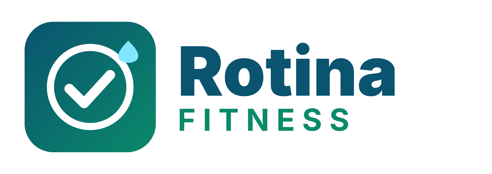

# Rotina Fitness

App de rotina diária, dieta, treino, água e progresso, com lembretes para o calendário do celular.
Funciona no navegador, instala na tela inicial e abre sem internet. Os registros ficam guardados só no aparelho de quem usa.

Treino: musculação, natação, ciclismo e corrida, até 2 treinos por dia (por exemplo, academia de manhã e natação à noite) e treino em jejum, com o café da manhã reorganizado para depois do treino.
Plano alimentar com caneta (Mounjaro, Ozempic, Wegovy e parecidas): na aba Dieta › Meu plano, informe o medicamento e a dose; o app reduz as porções, divide a comida em 6 refeições pequenas (com mini-refeição proteica), mantém a proteína, ajusta as metas e a lista de compras e lembra do dia da aplicação. Informação geral, não substitui orientação médica.
Aba Caneta (em Progresso, quando a caneta está ligada): anel de contagem até a próxima aplicação, com aviso de atraso e de dose a pular conforme a bula (Mounjaro 4 dias, Ozempic/Wegovy 5, Trulicity 4); histórico de aplicações com dose, local e observação; mapa do corpo para o rodízio dos locais (sugere o mais antigo); controle das doses que restam na caneta; resumo do tratamento; gráfico do nível estimado do medicamento no corpo (modelo simplificado, só para ver o ritmo da semana); gráfico do peso por fase de dose; quadro semanal de apetite, enjoo e energia junto dos dias de aplicação; e um resumo em texto para levar ao médico.
Registro diário da caneta: apetite, enjoo e energia com um toque, com sugestões (por exemplo, ajustar o nível de apetite do cardápio) e alerta de proteína atrasada no fim do dia. Sinais de enjoo forte ou energia baixa repetidos mandam procurar o médico.
Perfil com foto: tirar foto ou escolher da galeria, recorte quadrado. A foto entra no arquivo de backup e volta ao importar.
Backup: no app Android há backup automático semanal na pasta Downloads (perfis com PIN ficam de fora).
Aparência: texto normal, grande ou muito grande, e o modo "só o essencial" (Hoje, Treino, Dieta e Ajustes), e tema claro, escuro ou automático, em Ajustes.
Avisos com botões (Android): as notificações de água, refeição e treino têm botões "Marcar feito", "+250 ml" e "Adiar 15 min" que funcionam sem abrir o app; no dia livre ou de doença os avisos ficam em silêncio.
Preferências alimentares: em Ajustes, marque sem lactose, sem glúten, vegetariano ou sem ovo e liste o que evita; o cardápio, as trocas, as sugestões e a lista de compras respeitam isso, com aviso nos itens que conflitam.
"O que comer agora": na aba Hoje, quando falta proteína para a meta, o app sugere até 3 alimentos com a quantidade que fecha a conta, sem passar das calorias.
Resumo da semana e sequência: em Progresso › Mês e, aos domingos, na aba Hoje (dias cumpridos, proteína, água, peso e treinos, com uma dica), mais a sequência de dias com 80% ou mais da rotina e o recorde, sem culpa.
Treino: sugestão de volta leve depois de uma pausa e aviso de platô de carga, com ajuste da carga em um toque.
Fotos de progresso: em Progresso › Corpo, fotos de frente, lado e costas ficam só no aparelho e podem ser comparadas (antes e depois) com o peso da época.
Dia livre ou doente: pausa o dia sem quebrar a sequência nem entrar nas médias.
Lista de compras: compartilhar pelo WhatsApp ou outro app (só os itens que faltam).
Alarmes nativos (só no app Android): lembretes de refeições, treinos, água e da caneta tocam com a tela fechada e voltam sozinhos depois de reiniciar o celular. Ligue em Ajustes › Lembretes no celular. No Android 13 ou mais novo, o app pede permissão para mostrar avisos.
Fontes (Barlow e Barlow Condensed) vão embutidas no arquivo, sem depender da internet; licença SIL OFL 1.1 em `licencas/`.

- `logo/`: logo e ícone do app
- `index.html`: o app (arquivo único)
- `manifest.webmanifest` e `icons/`: nome e ícones para instalar
- `sw.js`: funcionamento offline
- `android/`: projeto Android que embute o `index.html` num WebView e gera o `.apk`
- `licencas/`: licença das fontes embutidas
- `.github/workflows/apk.yml`: compila o `.apk` no GitHub e publica na aba Releases (`apk-latest`)

## Baixar o .apk

Depois que a compilação termina (aba Actions), o arquivo fica em
`https://github.com/lucashenriquefernandestiburcio-glitch/rotina-app/releases/download/apk-latest/Rotina.apk`.
No Android é preciso permitir "instalar apps desconhecidos" para o navegador usado no download.

O `.apk` é assinado com a chave `android/keystore/rotina.jks`, que está neste repositório público de propósito:
serve só para manter a mesma assinatura entre versões (atualizar sem desinstalar). Não use este projeto em loja de apps sem trocar a chave.
